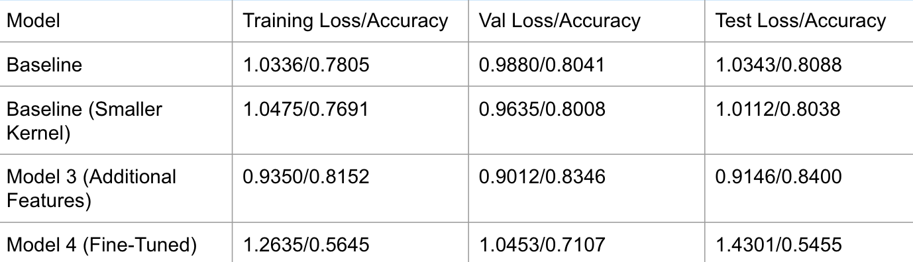

# CS109B_Final_Project

Classification of top 10 bird species in Europe using audio recodings scraped from [Xeno-Canto](https://xeno-canto.org/). Project partners: Kate Bowers, Ezra Feder, Kaleo Mungin, and Kevin Zhang.

Methodology:
1. Create mel-spectrograms of each scraped audio file
2. Cut into 10-second chunks, removing chunks with insufficient signal
3. Train a CNN to classify the chunks, appending latitude and longitude to the flattened vector at the end of the convolutional layers

Results:

